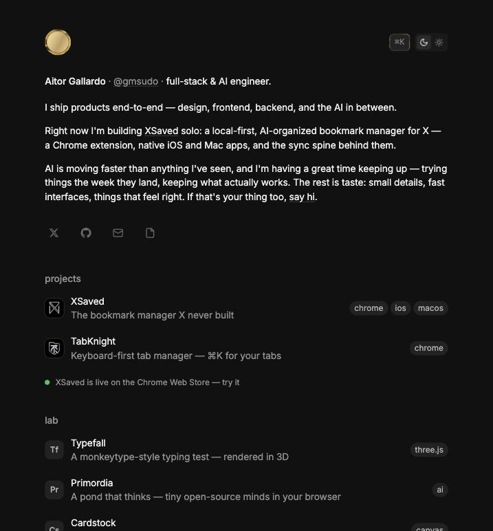
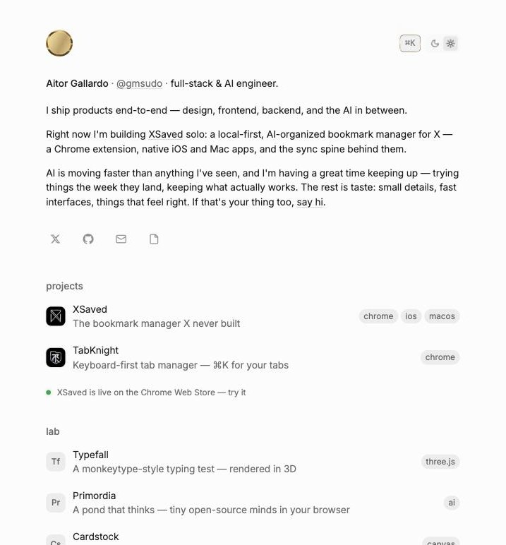
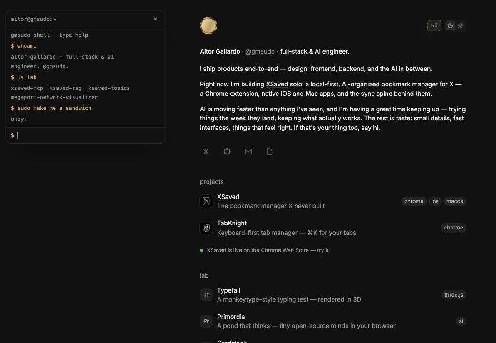

<div align="center">

# gmsudo

The personal site of Aitor Gallardo — [@gmsudo](https://x.com/gmsudo).

[](https://gmsudo.com)
[](https://x.com/gmsudo)

<br/>



<sub>The same page, in the light.</sub>



</div>

## What this is

One narrow column: who I am, what I've shipped, what I'm playing with. No nav to learn, nothing to wait for — the HTML is real and painted on the first frame, and the reveal on top is decoration. Each project links to a short case page written in MDX.

## The details worth knowing

- **⌘K command palette** (⌘⇧K works too) — jump to any section, project, or the theme toggle without reaching for the mouse.
- **A terminal.** Click the avatar to drop into a small shell. `whoami`, `ls lab`, `open tabknight`, `theme`, `sudo make me a sandwich`, and `play` all do something; `help` lists the rest.

<div align="center">

</div>

- **Play mode** (`play`, or the palette) hands every row to a matter-js physics simulation — grab and throw them around, and `Esc` snaps the page back to exactly where it was.
- **A gold identity** — a liquid-metal rim on the avatar and the ⌘K chip, gold text selection, and a green dot on anything that's actually live.
- **A lab of small toys**, each its own repo, each live:
  - [Typefall](https://aitorgallardo.github.io/typefall/) — a monkeytype-style typing test rendered in 3D (three.js + cannon-es).
  - [Primordia](https://aitorgallardo.github.io/primordia/) — a petri dish of organisms whose minds run a 135M-parameter LLM in your browser (three.js + transformers.js on WebGPU).
  - [Cardstock](https://aitorgallardo.github.io/cardstock/) — grab-and-throw physics over live, still-interactive DOM (matter-js); it's the engine behind this site's play mode.

## How it's built

- **Next.js** — App Router, `output: "export"`, so every route prerenders to static HTML.
- **MDX** case pages, with view transitions animating the jump from a home row to its page.
- **Radix Colors** for the gray scale, plus a small custom gold system (the `metal-fx` rims, the accent green) layered on top.
- **CSS-first reveals** — the stagger animation is decorative, never a loading gate, and respects `prefers-reduced-motion`.
- **Bun** for install, dev, and build.

Lighthouse on the deployed build: **93 / 100 / 100 / 100** (performance / accessibility / best practices / SEO).

## Running it

```bash
bun install
bun run dev      # local dev
bun run build    # lint chain + static export to out/
```

## Lineage

The third life of this site: [v0](https://aitorgallardo.github.io/portfolio-v0/) (Astro) → [v1](https://aitorgallardo.github.io/portfolio-v1/) (first Next.js take) → gmsudo, now on its own domain at [gmsudo.com](https://gmsudo.com).

---

<div align="center">
<sub>© Aitor Gallardo · <a href="https://x.com/gmsudo">@gmsudo</a></sub>
</div>
